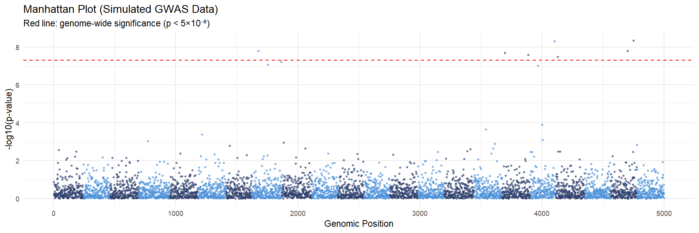
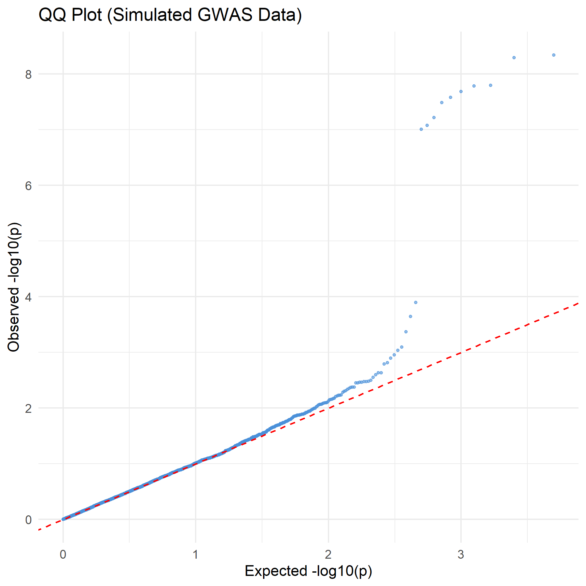

# R & Bioinformatics Learning Portfolio — Kim Jihyun

Self-directed preparation for graduate research in genomic data analysis,  
with focus on GWAS, eQTL analysis, and multi-omics integration  
in the context of complex inflammatory diseases.

---

## Background

I have hands-on wet lab experience in molecular biology techniques including  
PCR-based genotyping, species-specific primer and probe design,  
qPCR workflow optimization, and nucleic acid extraction,  
gained through undergraduate research and industry QC roles (CELLSAFE Co., Ltd.).

I am now building computational skills to complement my experimental background,  
with a focus on genomic variant analysis and immunogenomics data processing.

---

## Learning Roadmap

### Phase 1 · R Fundamentals (Month 1–2)
- [x] R installation and RStudio environment setup
- [ ] Data structures and basic syntax (vectors, data frames, functions)
- [ ] Data import and wrangling with tidyverse (dplyr, tidyr)

### Phase 2 · Visualization and Statistics (Month 2–3)
- [ ] Data visualization with ggplot2
- [x] GWAS summary statistics visualization (Manhattan plot, QQ plot)
- [ ] Basic statistical analysis (t-test, ANOVA, linear regression)

### Phase 3 · Genomics Applications (Month 3–6)
- [ ] PLINK: SNP filtering, population stratification (PCA)
- [ ] eQTL analysis concepts and practice
- [ ] Multi-omics integration (gene expression + DNA methylation)
- [ ] Mini project: visualization of public GWAS summary statistics

---

## Skills in Progress

| Tool / Package | Purpose | Status |
|---|---|---|
| R / RStudio | Programming environment | 🔄 In progress |
| tidyverse | Data wrangling | 🔄 In progress |
| ggplot2 | Visualization | 🔄 In progress |
| PLINK | SNP-level analysis | 📅 Planned |
| GATK | Variant calling pipeline | 📅 Planned |
| ANNOVAR | Functional annotation | 📅 Planned |

---

## Wet Lab Background

- PCR-based genotyping (*Arabidopsis thaliana* mkk7/mkk9 mutant lines)
- Species-specific primer and probe design (CHO cell genomic DNA quantification)
- 16-species plant virus detection kit development (commissioned by APQA)
- qPCR workflow design and optimization
- Nucleic acid extraction and quantification
- ISO 13485 QC documentation

---

## Goal

To integrate wet lab molecular biology experience with computational genomics skills,  
and contribute to research on the genetic basis of complex inflammatory diseases  
at the graduate level.

---

*Last updated: April 2026*
---
## Projects

### 01. GWAS Visualization

